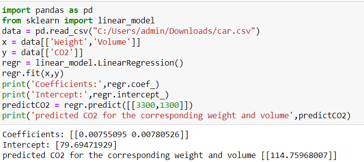

# Implementation of Multivariate Linear Regression
## Aim
To write a python program to implement multivariate linear regression and predict the output.
## Equipment’s required:
1.	Hardware – PCs
2.	Anaconda – Python 3.7 Installation / Moodle-Code Runner
## Algorithm:
### Step1
<b>Import Necessary Libraries: </b>Start by importing the required libraries. In this case, we import pandas for data manipulation and sklearn.linear_model for implementing linear regression.

### Step2
<b>Load the Data:</b> Read the dataset into a pandas DataFrame using the pd.read_csv() function. Ensure that the path to the CSV file is correctly specified.

### Step3
<b>Define Features and Target Variable:</b> Specify the features (independent variables) and the target variable (dependent variable) from the dataset. In this case, 'Weight' and 'Volume' are selected as features (x), while 'CO2' is the target variable (y).

### Step4
<b>Create a Linear Regression Model:</b> Instantiate a linear regression model object using linear_model.LinearRegression(). This object will be used to fit the model to the data.

### Step5
<b>Fit the Model and Predict:</b> Fit the linear regression model to the data using the fit() method, passing the features (x) and target variable (y). After fitting the model, use it to predict the CO2 emissions for a specific weight and volume combination. Print the coefficients, intercept, and the predicted CO2 value.

## Program:
```
/*
Program to implement multivariate linear regression and to predict the output:
Developed by: S.Sajetha
Register number: 212223100049
*/
```
```
import pandas as pd
from sklearn import linear_model
data = pd.read_csv("C:/Users/admin/Downloads/car.csv")
x = data[['Weight','Volume']]
y = data[['CO2']]
regr = linear_model.LinearRegression()
regr.fit(x,y)
print('Coefficients:',regr.coef_)
print('Intercept:',regr.intercept_)
predictCO2 = regr.predict([[3300,1300]])
print('predicted CO2 for the corresponding weight and volume',predictCO2)
```
## Output:


## Result
Thus the multivariate linear regression is implemented and predicted the output using python program.